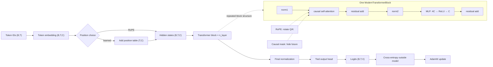

# Model Architecture

This file describes the model that is actually implemented now. It is a
decoder-only language model: it predicts the next token using only the current
token and tokens to its left.

## 1. High-level understanding

The current model is `ModernLanguageModel` in
`src/llm_lab/model/modern_lm.py`:

```text
token IDs (B,T)
    ↓
token embeddings (B,T,C)
    ↓
learned position embeddings, or RoPE inside attention
    ↓
N pre-norm Transformer blocks (B,T,C)
    ↓
final normalization (B,T,C)
    ↓
tied vocabulary projection
    ↓
logits (B,T,V)
```

The model returns logits only. Loss calculation, optimization, validation, and
generation live outside the model in `src/llm_lab/training/loop.py`.



## 2. Intuition / small example

Suppose the input is the token sequence:

```text
Alice was beginning
```

The tokenizer turns it into integer IDs. If it happens to produce four IDs and
the batch contains one sequence, the model sees:

```text
token IDs:          (B,T)   = (1,4)
token embeddings:   (B,T,C) = (1,4,64)
logits:             (B,T,V) = (1,4,512)
```

At the fourth position, the causal mask allows attention to positions 1–4 but
not to a future fifth token. The fourth row of logits is therefore a score for
what token should come next after the visible context.

One Transformer block has two residual updates:

```python
x = x + attention(norm1(x))
x = x + mlp(norm2(x))
```

The residual connection means each sublayer proposes an update while the
original representation remains available. The MLP temporarily expands each
token vector from `C` to `4C`, applies ReLU, and contracts it back.

RoPE changes the query and key vectors according to their positions. Values are
not rotated. Learned positions instead add a trainable position vector to each
token embedding before the Transformer blocks.

## 3. Detailed explanation

### Current study configuration

The Phase 11 architecture study uses:

| Symbol | Config key | Current value | Meaning |
|---|---|---:|---|
| `V` | `vocab_size` | 512 | tokenizer vocabulary size |
| `T_max` | `block_size` | 128 | maximum context length |
| `C` | `d_model` | 64 | hidden width |
| `H` | `n_head` | 4 | attention heads |
| `D` | `C / H` | 16 | width of each head |
| `N` | `n_layer` | 2 | Transformer blocks |
| `4C` | derived | 256 | MLP hidden width |
| activation | `activation` | ReLU | MLP nonlinearity |
| attention | `attention` | causal MHA | educational manual implementation |

The four experiment variants change only normalization and positional encoding:

| Variant | Normalization | Position information | Unique parameters |
|---|---|---|---:|
| `layer_norm_learned` | LayerNorm | learned table | 122,624 |
| `rms_norm_learned` | RMSNorm | learned table | 122,304 |
| `layer_norm_rope` | LayerNorm | RoPE | 114,432 |
| `rms_norm_rope` | RMSNorm | RoPE | 114,112 |

Counts above use `build_parameter_report`, which counts the tied embedding/output
parameter once. The serialized `state_dict` contains both parameter names for
that shared tensor, so its raw tensor-value total is larger than the trainable
parameter count.

### Shape ledger

Let `B` be batch size, `T` sequence length, `C` model width, `V` vocabulary
size, and `D = C / H` head width.

| Stage | Shape | Implemented by |
|---|---|---|
| input IDs | `(B,T)` | caller / data loader |
| token lookup | `(B,T,C)` | `ModernLanguageModel.token_embeddings` |
| learned position lookup | `(T,C)` | `position_embeddings`, learned mode only |
| attention input | `(B,T,C)` | `ModernTransformerBlock` |
| one head Q/K/V | `(B,T,D)` | `SingleHeadCausalSelfAttention` |
| one head scores | `(B,T,T)` | `q @ k.transpose(-2,-1)` |
| one head output | `(B,T,D)` | masked softmax multiplied by `v` |
| concatenated attention output | `(B,T,C)` | `MultiHeadCausalSelfAttention` |
| MLP hidden | `(B,T,4C)` | `ModernFeedForward.up_projection` |
| MLP output | `(B,T,C)` | `ModernFeedForward.down_projection` |
| vocabulary logits | `(B,T,V)` | `output_head` |
| flattened loss input | `(B*T,V)` | `compute_loss` |

### Source-file map

| Component | File | Responsibility |
|---|---|---|
| model contract | `src/llm_lab/model/config.py` | validates sizes and selectable components |
| model assembly | `src/llm_lab/model/modern_lm.py` | embeddings, block stack, final norm, tied head |
| Transformer block | `src/llm_lab/model/modern_block.py` | pre-norm residual attention and MLP |
| attention | `src/llm_lab/model/attention.py` | causal mask, heads, Q/K/V, optional RoPE hook |
| RoPE | `src/llm_lab/model/rope.py` | cosine/sine cache and pairwise rotations |
| normalization | `src/llm_lab/model/normalization.py` | RMSNorm implementation |
| factories | `src/llm_lab/model/factories.py` | maps config names to modules |
| parameter report | `src/llm_lab/model/inspection.py` | counts unique and trainable parameters |
| checkpoint loading | `src/llm_lab/model/checkpoint.py` | rebuilds a modern model from saved metadata |
| training | `src/llm_lab/training/loop.py` | cross-entropy, AdamW, train/validation steps, greedy generation |

### What is implemented versus planned

Implemented now:

- token and optional learned position embeddings;
- causal multi-head self-attention with an educational per-head loop;
- LayerNorm or RMSNorm;
- learned positions or RoPE;
- ReLU MLP with width `4 * d_model`;
- pre-norm residual blocks;
- tied input embeddings and output projection;
- float32 training with AdamW;
- greedy generation and saved modern checkpoints.

Not implemented yet:

- QK norm, GQA, sliding-window attention, SDPA/Flash Attention adapters;
- explicit mixed-precision policy or a production optimizer;
- KV-cache inference or context-window cropping;
- evaluation suite, SFT, RL, chat CLI, or web UI.

Those items remain separate roadmap phases. The authoritative planned order is
in `LLM_FROM_SCRATCH_REPO_BLUEPRINT.md`; the implemented order is in
`docs/phases/README.md`.
